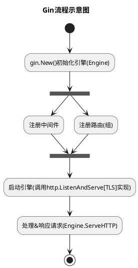

# 深入理解Gin的实现

> OS：Windows 10 专业版-21H2

> IDE：GoLand 2022.3

> Gin Version：v1.9.0


一款精简到了极致的开源Web框架，有路由、中间件和崩溃处理（为了服务的持续可用）等，对于接口站点来说就已经足够了，不过可能考虑到一些应用场景，还是内置了模板渲染。就我个人来说，可不想再看见`html`模板渲染那套东西，那段记忆太痛苦了。简单来说，就是装饰了一下内置的`net/http`，帮开发者做了些业务之外的处理，让开发者专注于业务处理，其实这也就是框架的本质。在很大程度上，提高了开发者的效率，但也在某个角度来说，弱化了部分开发者（不去思考背后的原理）的专业技术能力。可能就是所谓的`优胜劣汰`吧，自己的选择注定了自己的未来。这样说来，我也差不多，平时只顾着任务，也没作什么总结和思考，导致了现在的窘境。

废话不多说，开始进入正题。首先，我是假定你们听过`Gin`这个框架的，合情合理。

### 预热一下

**下载源码**

分析源码，自然是要先下载，挺方便的，一条命令搞定：`git clone --branch v1.9.0 git@github.com:gin-gonic/gin.git`。

**Gin流程示意图**

这里提前备个流程图，先看看，大概了解下整体流程。看完之后，是不是感觉很简单，好像自己也可以包装一个？如果有兴趣的朋友。。。不过，这个图会不会太简陋了。




### 初始化引擎

如果你们使用过，应该是知道的，短短几行代码就可以启动个Web服务。不过仅仅是启动的话，估计也就这么一行：`gin.Default().Run()`，没有手动注册任何路由。那么，就来看看到底发生了什么。

```golang
// gin.go
func New() *Engine {
	engine := &Engine{
		RouterGroup: RouterGroup{ // 这里注册了个根路由组
			root:     true, ...
		}, ...
	}
    // 搁这儿路由套娃？玩出了花真是
    // 后面看到RouterGroup.handle()调用engien.addRoute()就明白了
	engine.RouterGroup.engine = engine

    // sync.Pool是非常重要的，后面应该会单独开一篇讲这个，主要会涉及到GC和GMP
    // 可以简单的把当作池子（用了之后可以归还），缓存和复用对象, 这里也就是context，减少GC压力
    // 毕竟用一个新建一个，那不是之前创建的都没有引用了，那不是要被回收了？分配内存还是挺烦的
    // pool.Get()没有从池子里面获取到对象，就会调用New函数，新建，否则就会返回nil
    // pool.Put()可以归还取出来的对象（使用完之后可以归还）
    // 是不是数据库连接池既视感
    // 不过这个理论上来说，池子中的对象数量没有上限，内存足够的话；不过一定时间内不用，还是会被回收掉的，不能占着茅坑不那啥是吧
    // 只能感叹一句，太go了
	engine.pool.New = func() any {
        // engine.maxParams 从路由解析出来参数的最大数量
		return engine.allocateContext(engine.maxParams)
	}
	return engine
}

func (engine *Engine) allocateContext(maxParams uint16) *Context {
    // KV键值对 Params []struct { Key string    Value string }
	v := make(Params, 0, maxParams)
	skippedNodes := make([]skippedNode, 0, engine.maxSections)
    // 这里应该是存在内存逃逸的，内部变量被外部引用，所以变量被分配在了堆区
    // 毕竟函数栈嘛，一般没什么特殊情况，应该是在栈区的
	return &Context{engine: engine, params: &v, skippedNodes: &skippedNodes}
}
```

那么问题来了，有了`New()`，为什么还要创建个`Default()`供调用者使用。

```golang
// gin.go
func Default() *Engine {
    // 这里点一下，如果调用Default()创建的引擎，在Debug模式下，就会提示
    // [WARNING] ... Logger and Recovery middleware already attached.
    // 因为我之前老是遇到这个，烦死了。警告也不会影响什么，所以就没有看到底怎么回事
    // 头铁，继续用
	debugPrintWARNINGDefault()
	engine := New() // 直接调用New()创建的引擎
    // Engine.Use()是注册中间件函数。这里默认注册两个中间件，打日志和处理崩溃的
    // 打日志还好说，崩溃了不处理的话，服务就废了。所以，Recovery()是必需的
    // 如果不知道有Recovery()的人，用New()创建引擎，崩溃就挂掉，可能会被烦死吧
    // 不过这些都是可以自定义的，还有常见的中间件就是CORS
	engine.Use(Logger(), Recovery())
	return engine
}
```


### 参考资料

> 排名不分先后

[Gin Web Framework](https://gin-gonic.com/zh-cn/)

[Gin框架介绍及使用](https://www.liwenzhou.com/posts/Go/gin/#autoid-0-0-0)

[全网最详细的gin源码解析](https://blog.csdn.net/luo1324574369/article/details/108310032)

[Gin源码简要分析](https://yeqown.xyz/2020/01/21/gin%E6%BA%90%E7%A0%81%E7%AE%80%E8%A6%81%E5%88%86%E6%9E%90/)

[路由查找之Radix Tree](https://michaelyou.github.io/2018/02/10/%E8%B7%AF%E7%94%B1%E6%9F%A5%E6%89%BE%E4%B9%8BRadix-Tree/)