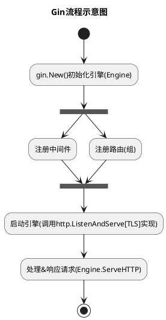

# 深入理解Gin的实现

> OS：Windows 10 专业版-21H2

> IDE：GoLand 2022.3

> Go Version：go1.19 windows/amd64

> Gin Version：v1.9.0


一款精简到了极致的开源Web框架，有路由（`Radix 树`）、中间件和崩溃处理（为了服务的持续可用）等，对于接口站点来说就已经足够了，不过可能考虑到一些应用场景，还是内置了模板渲染。就我个人来说，可不想再看见`html`模板渲染那套东西，那段记忆太痛苦了。简单来说，就是装饰了一下内置的`net/http`，帮开发者做了些业务之外的处理，让开发者专注于业务处理，其实这也就是框架的本质。在很大程度上，提高了开发者的效率，但也在某个角度来说，弱化了部分开发者（不去思考背后的原理）的专业技术能力。可能就是所谓的`优胜劣汰`吧，自己的选择注定了自己的未来。这样说来，我也差不多，平时只顾着任务，也没作什么总结和思考，导致了现在的窘境。

废话不多说，开始进入正题。首先，我是假定你们听过`Gin`这个框架的，合情合理。

### 预热一下

**下载源码**

分析源码，自然是要先下载，挺方便的，一条命令搞定：`git clone --branch v1.9.0 git@github.com:gin-gonic/gin.git`。

**Gin流程示意图**

这里提前备个流程图，先看看，大概了解下整体流程。看完之后，是不是感觉很简单，好像自己也可以包装一个？如果有兴趣的朋友。。。不过，这个图会不会太简陋了。




### 初始化引擎

#### New()和Default()

如果你们使用过，应该是知道的，短短几行代码就可以启动个Web服务。不过仅仅是启动的话，估计也就这么一行：`gin.Default().Run()`，没有手动注册任何路由。那么，就来看看到底发生了什么。

```golang
// gin.go
func New() *Engine {
	engine := &Engine{
		RouterGroup: RouterGroup{ // 这里注册了个根路由组
			root:     true, ...
		}, ...
	}
    // 搁这儿路由套娃？玩出了花真是
    // 后面看到RouterGroup.handle()调用engien.addRoute()就明白了
	// 反向调用，调用者添加路由，和路由管理是分开的
	engine.RouterGroup.engine = engine

    // sync.Pool是非常重要的，后面应该会单独开一篇讲这个，主要会涉及到GC和GMP
    // 可以简单的把当作池子（用了之后可以归还），缓存和复用对象, 这里也就是context，减少GC压力
    // 毕竟用一个新建一个，那不是之前创建的都没有引用了，那不是要被回收了？分配内存还是挺烦的
    // pool.Get()没有从池子里面获取到对象，就会调用New函数，新建，否则就会返回nil
    // pool.Put()可以归还取出来的对象（使用完之后可以归还）
    // 是不是数据库连接池既视感
    // 不过这个理论上来说，池子中的对象数量没有上限，内存足够的话；不过一定时间内不用，还是会被回收掉的，不能占着茅坑不那啥是吧
    // 只能感叹一句，太go了
	engine.pool.New = func() any {
        // engine.maxParams 从路由解析出来参数的最大数量
		return engine.allocateContext(engine.maxParams)
	}
	return engine
}

func (engine *Engine) allocateContext(maxParams uint16) *Context {
    // KV键值对 Params []struct { Key string    Value string }
	v := make(Params, 0, maxParams)
	skippedNodes := make([]skippedNode, 0, engine.maxSections)
    // 这里应该是存在内存逃逸的，内部变量被外部引用，所以变量被分配在了堆区
    // 毕竟函数栈嘛，一般没什么特殊情况，应该是在栈区的
	return &Context{engine: engine, params: &v, skippedNodes: &skippedNodes}
}
```

那么问题来了，有了`New()`，为什么还要创建个`Default()`供调用者使用。可能是怕有人忘了处理崩溃，或者嫌弃麻烦吧。

```golang
// gin.go
func Default() *Engine {
    // 这里点一下，如果调用Default()创建的引擎，在Debug模式下，就会提示
    // [WARNING] ... Logger and Recovery middleware already attached.
    // 因为我之前老是遇到这个，烦死了。警告也不会影响什么，所以就没有看到底怎么回事
    // 头铁，继续用。。。我还没试过，如果注册了，再注册，应该会执行两次吧？？？
    // 暂时没看到过有什么唯一标识
	debugPrintWARNINGDefault()
	engine := New() // 直接调用New()创建的引擎
    // Engine.Use()是注册中间件函数。这里默认注册两个中间件，打日志和处理崩溃的
    // 打日志还好说，崩溃了不处理的话，服务就废了。所以，Recovery()是必需的
    // 如果不知道有Recovery()的人，用New()创建引擎，崩溃就挂掉，可能会被烦死吧
    // 不过这些都是可以自定义的，还有常见的中间件就是CORS
	engine.Use(Logger(), Recovery())
	return engine
}
```

现在框架里面暴露出来的引擎初始化函数就这两个（`New() Default()`），当然也可以自定义函数初始化，毕竟需要初始化的内容，可以说是非常少。只要返回的是`*gin.Engine`就可以了（需要魔改，毕竟存在私有属性）。

#### gin.Engine

那么，就来看看`gin.Engine`这个结构体吧，毕竟说了那么多关于这个的初始化。

```golang
// gin.go

type Engine struct {
    // 嵌套路由组结构体，后面还有个小细节：var _ IRouter = (*Engine)(nil)
    // 确定Engine实现了IRouter接口，nil是有点好用，零内存吧？挺直接的，编译就可以检测出来。
	RouterGroup 

	// 是否启动尾斜杠路由重定向到（不）含尾斜杠的路由（存在），比如 /test/ => /test
    // 需要注意的是 GET => 301(httpCode) OTHERS => 307(httpCode)
    // 默认值：true
	RedirectTrailingSlash bool

    // 是否修复重定向路由，这个有点奇怪，路由写错，还要程序负责兜底校正。。。
    // 依赖RedirectTrailingSlash配置，RedirectTrailingSlash未true，这个才会尝试路由修复（enabled了话）
    // 主要修复多余路径（../或//），然后匹配是否存在对应路由（不区分大小写）
    // 也就是说：/Test和/..//Test都会重定向到/test，如果存在的话
    // 后面的重定向就是 RedirectTrailingSlash 一样了
    // 默认值：false
	RedirectFixedPath bool

    // 检测是否存在当前路由的其他类型，如果当前请求路由无法调度的话（有点探测的意思）
    // 如果找到了，就提示不允许（405），意思是换一个Method？
    // 反之，就是NotFound（404)了。。。怎么看，都有点不安全，这个东西
    // 默认值：false
	HandleMethodNotAllowed bool

	// 是否由客户端IP转发，具体使用参考(*gin.Context).ClientIP()
	// 开启就会去解析(*gin.Engine).RemoteIPHeaders（存有客户端IP的头索引）
	// (*gin.Context).Request.RemoteAddr`兜底处理，其实先获取的这个
	// 默认值：true
	ForwardedByClientIP bool

	// [已弃用]是否信任谷歌应用引擎（就是X-AppEngine开头的请求头）
	// 有点刻板了，所以被弃用的？
	// 采用指定TrustedPlatform为gin.PlatformGoogleAppEngine代替
	AppEngine bool
	
	// 是否使用原始路径，如果开启了的话，就会在其中找参数，可以参考(*gin.Engine.handleHTTPRequest())
	// 默认值：false
	UseRawPath bool

	// 是否解码路由参数，毕竟路由传参，有些事需要转义的，也就是编码（url.Encode()）
	// 如果 UseRawPath==false && UnescapePathValues==true，那么
	// 传到(*gin.node).getValue()中的path就是url.Path（已解码）
	// 似乎没有规避，统一处理的
	// 默认值：true
	UnescapePathValues bool

	// 是否移除批量斜杠，详细参考gin.cleanPath()
	// 默认值：false
	RemoveExtraSlash bool

	// 持有客户端IP的请求头参数
	// 默认值：[]string{"X-Forwarded-For", "X-Real-IP"}
	RemoteIPHeaders []string

	// 信任平台请求头参数，也是用来检测客户端IP的
	// 详细参考(*gin.Context).ClientIP()
	// 默认值：defaultPlatform，在appengine环境下赋值为gin.PlatformGoogleAppEngine
	// 也就是X-Appengine-Remote-Addr
	TrustedPlatform string

	// 请求体表单最大内存
	//默认值：defaultMultipartMemory(即32MB)
	MaxMultipartMemory int64

	// 是否启用h2c（http/2的非加密连接）
	UseH2C bool

	// 是否启用回退（如果请求上下文为空的情况下）
	// 主要是(*gin.Context).Deadline()，Done()，Err()和Value()
	ContextWithFallback bool

	// 模板渲染分隔符
	// 默认值： render.Delims{Left: "{{", Right: "}}"}
	delims render.Delims

	// 安全JSON前缀，就是在标准JSON前追加特殊字符串，让客户端无法直接JSON解析
	// 默认值："while(1);"  可通过调用SecureJsonPrefix()设置
	secureJSONPrefix string

	// HTML渲染实例，需要引用到delims和FuncMap
	HTMLRender render.HTMLRender

	// 模板函数集合
	// 默认值：template.FuncMap{}
	FuncMap template.FuncMap

	// 无路由处理句柄链（所有），也就是404处理句柄
	allNoRoute HandlersChain

	// 无路由方法（Method）处理句柄链（所有），也就是405处理句柄
	allNoMethod HandlersChain

	// 无路由处理句柄链，通过(*gin.Engine).NoRoute()设置
	noRoute HandlersChain

	// 无路由方法（Method）处理句柄链，通过(*gin.Engine).NoMethod()设置
	noMethod HandlersChain

	// 请求上下文连接池，初始化指定了pool.New处理句柄
	pool sync.Pool

	// Mehtod构成的基数树（后面路由那里会具体分析）
	// 默认值：make(methodTrees, 0, 9)，以METHOD开始的树
	trees methodTrees 

	// 最大参数数量，每次添加路由时，都要比较的
	maxParams uint16 

	// 最大路由节数量，每次添加路由时，都要比较的
	maxSections uint16 

	// 受信代理
	// 默认值：[]string{"0.0.0.0/0", "::/0"},
	trustedProxies   []string

	// 受信无类别域间路由，IP网络段？
	// 默认值：defaultTrustedCIDRs
	trustedCIDRs     []*net.IPNet
}

```

看完这个核心结构体，需要涉及到模块，似乎也不多，路由和请求连接池等，似乎没看到中间件？其实不然，后面看了路由的相关实现，就清楚了。

#### 小结

差不多，插个小结吧。初始化引擎几乎可以说就是`*gin.Engine`的初始化，没什么额外的处理，在快捷方法`(*gin.Engine).Default()`中倒是默认注册了两个中间价`gin.Logger`和`gin.Recovery()`。需要注意的有以下几点：

1. `gin.Engine`嵌套了`gin.RouterGroup`，主要是为了共享`RouterGroup`实现的`IRouter`进行路由管理。因此就多了这么一行代码`var _ IRouter = (*Engine)(nil)`，检测`*gin.Engine`是否实现了`IRouter`接口，`nil`用的很漂亮（在`RouterGroup`那里也有一样的操作）；

2. 在使用`gin.Default()`初始化时，有必要单独指定`gin.DefaultWriter`（`Logger`的输出，默认`stdout`）和`gin.DefaultErrorWriter`（`Recovery`的日志输出，默认`stderr`）；


### 路由的实现

#### 基数树

基数树（Radix Tree），也叫压缩前缀树，一种特殊的前缀树（字典树，树形数据结构，根节点不包含字符，但子节点只包含单个字符，从根节点到指定节点经过路径连接起来的字符串就是该节点对应的字符串值。主要是空间换时间，使用了字符串的公共前缀来加速查询），通过向上合并单一节点的处理，优化一定空间占用。

#### 数据结构

在`(*gin.Engine).addRoute()`中可以看到，路由树是根据请求方法分成了九个，那么就先来看看方法树吧。

```golang
// tree.go

// 方法树，其中method就是http-method。这里实现不多，就全部贴出来了
type methodTree struct {
	// 请求方法名称，也就是http-method
	method string
	// 绑定的根节点（路由）
	root   *node
}

type methodTrees []methodTree

func (trees methodTrees) get(method string) *node {
	for _, tree := range trees {
		if tree.method == method {
			return tree.root
		}
	}
	return nil
}
```

`methodTree`主要就是挂载路由节点，并进一步细分，加速查询。所以接下来就是路由节点了。

```golang
// tree.go

type node struct {
	// 节点对应路由路径
	path      string

	// 子节点路由索引集合（前缀）
	indices   string
	
	// 是否为参数节点，毕竟支持:name路由参数绑定的
	// 关于这个参数，还是有点含糊
	wildChild bool
	
	// 节点类型（nodeType）
	// static(0) 静态节点（常规普通节点）
	// root(1) 根节点
	// param(2) 参数节点，比如:name
	// catchAll(3) 全匹配节点（*）
	nType     nodeType

	// 优先级
	priority  uint32
	
	// 子节点切片
	children  []*node
	
	// 当前节点处理句柄链（切片）（[]HandlerFunc）
	// 最大支持62个句柄
	handlers  HandlersChain
	
	// 当前节点对应的路由全路径
	fullPath  string
}
```

#### 添加路由

这里是有一定曲折的，调用者添加路由是通过路由组`RouterGroup`方法来添加的，但路由是由`gin.Engine.trees`管理的，这里就需要个桥接，所以在初始化引擎时，需要将当前引擎赋给路由组，然后就有了`group.engine.addRoute(httpMethod, absolutePath, handlers)`这种反向注册调用。因为这是结构体嵌入，实质就是个属性，如果不显式初始化，那么就是空值，自然在添加路由时，就会`Panic`了。

这里还是来看看路由管理里面的添加。至于`RouterGroup`那部分，相对就比较简单了，毕竟那部分是开放给调用者的接口，后面看情况要不要做个简单分析。

前面已经提到过好几次`addRouter`这个关键词，很简单，这就是`gin.Engine`获取路由树添加路由的入口函数。

##### 唯一入口

确实，`(*gin.Engine).addRoute()`就是引擎添加路由的唯一入口，可以参考`gin.RouterGroup`对`gin.IRoutes`接口的具体实现，基本上归结到了`(*gin.RouterGroup).handle()`。在合并了路由的路径和句柄之后，就直接是`group.engine.addRoute()`，然后就是定位路由树（之前提过，根据请求方法做了分割）。然后通过`(*gin.node).addRoute()`实现路由的添加，之后更新参数的路由节的最大数量（`maxParams & maxSections`）。

```golang
// gin.go

// 主要就是定位路由树
func (engine *Engine) addRoute(method, path string, handlers HandlersChain) {

	// 有些基础的断言前提和打印（我这里就直接移除了，不重要）
	// 主要就是：路径必须以/开始，请求方法不能为空，必须有一个处理句柄

	root := engine.trees.get(method)
	if root == nil {
		root = new(node)
		root.fullPath = "/"
		engine.trees = append(engine.trees, methodTree{method: method, root: root})
	}

	// (*gin.node).addRoute()
	root.addRoute(path, handlers)

	// 更新参数和路由节最大数量
	// 主要是根据当前path中的:、*和/来统计，其中bytesconv.StringToBytes()倒是挺不错，后面应该会单独介绍
}
```

##### 定位节点

其实也是添加路由（`(*gin.node).addRoute()`），不过在添加之前，还是应该先找到路由添加的具体节点，这个可不是什么线性的结构。当然，如果这是首个路由的话，那么直接就是：

```golang
// 感觉首个路由添加应该是最快的，直觉来说的话。
if len(n.path) == 0 && len(n.children) == 0 {
	// insertChild才是实际添加路由节点的实现么，不，还要检测通配符之类的。所以这还是个Wrapper，做了层路由路径通配符分析。
	// 只是这几个函数名字，看得我有些。。。烦，难道是角度的问题？
	// addRoute() insertChild() addChild()
	// 添加路由，插入子节点，添加子节点。。。
	// 不排除存在通配路由的可能性，所以还是要做通配检测，走一遭insertChild()
	n.insertChild(path, fullPath, handlers)
	// 当前节点自然就标记为根节点，没有问题。
	n.nType = root
	return
}
```

如果路由树下已经有了节点，那就要根据前缀定位到指定路由下，如果更深层次的，循环次数也就更多了：

```golang
// tree.go

// 这里采用goto式，毕竟迭代，这还是挺不错的。
walk:
for {
	// 直接来找新路由路径和当前节点的公共前缀最大索引（也就是字符下标）。
	// 记为公共索引。
	i := longestCommonPrefix(path, n.path)

	// 当公共索引小于当前节点路由长度时，那就会分裂当前节点，这可是压缩前缀树诶
	// 也就是根据公共索引拆分当前节点的path，然后将句柄那些挂过去。重置当前节点
	// [:]，左开右闭型
	if i < len(n.path) {
		child := node{
			path:      n.path[i:],
			nType:     static,
			// 因为在函数一进来，就加了1，默认是要增加路由长度的，这里只是简单的分裂，不涉及增加长度
			priority:  n.priority - 1,
			... // 其他属性都继承当前节点的值
		}
		n.children = []*node{&child}
		// 直接重置子节点索引，是因为这肯定是第一个分支
		n.indices = bytesconv.BytesToString([]byte{n.path[i]})
		n.path = path[:i] // 截断路径更新
		n.handlers = nil // 重置句柄，这里不涉及，已经给了刚分裂出去的节点
		n.wildChild = false // 不是通配节点？
		// 毕竟做了截断，那么，这个全路径也会相应处理的
		// 其中parentFullPathIndex初始值为0
		n.fullPath = fullPath[:parentFullPathIndex+i]
	}

	// 如果公共索引小于新路由路径的话，那就会进行分割处理
	if i < len(path) {
		path = path[i:] // 先更新path，毕竟小于i的部分是和当前路由节点重复的，直接截断
		c := path[0] // 获取首字符，定位到对应子节点。如果存在的话，就继续循环迭代。没有的话，有添加的可能性

		// 参数节点之后的路由，如果当前节点只有一个子节点，那直接切到对应子节点，更新优先级，继续迭代
		if n.nType == param && c == '/' && len(n.children) == 1 {
			parentFullPathIndex += len(n.path)
			n = n.children[0]
			n.priority++
			continue walk
		}

		// 检测对应字符索引是否存在，如果存在的话，就切到对应子节点进行迭代
		for i, max := 0, len(n.indices); i < max; i++ {
			if c == n.indices[i] {
				parentFullPathIndex += len(n.path)
				i = n.incrementChildPrio(i)
				n = n.children[i]
				continue walk
			}
		}

		// 如果当前节点不是全匹配节点，并且首字符不是通配字符
		if c != ':' && c != '*' && n.nType != catchAll {
			// 更新子节点字符索引
			n.indices += bytesconv.BytesToString([]byte{c})
			child := &node{ fullPath: fullPath }
			n.addChild(child)
			n.incrementChildPrio(len(n.indices) - 1)
			n = child
		} else if n.wildChild { // 如果当前节点是通配节点，那就需要检测和当前的通配符是否冲突了
			n = n.children[len(n.children)-1]
			n.priority++

			// 检测通配符是否匹配
			// 禁止向全匹配节点添加子节点
			// 检测是否更长的通配符路由
			if len(path) >= len(n.path) && n.path == path[:len(n.path)] &&
				n.nType != catchAll &&
				(len(n.path) >= len(path) || path[len(n.path)] == '/') {
				continue walk
			}

			// 通配符冲突了，那就panic
			pathSeg := path
			if n.nType != catchAll {
				pathSeg = strings.SplitN(pathSeg, "/", 2)[0]
			}
			prefix := fullPath[:strings.Index(fullPath, pathSeg)] + n.path
			panic("'" + pathSeg +
				"' in new path '" + fullPath +
				"' conflicts with existing wildcard '" + n.path +
				"' in existing prefix '" + prefix +
				"'")
		}

		n.insertChild(path, fullPath, handlers)
		return
	}

	if n.handlers != nil {
		panic("handlers are already registered for path '" + fullPath + "'")
	}
	n.handlers = handlers
	n.fullPath = fullPath
	return
}
```

##### 添加节点

差不多就是添加路由节点的最后一块了，不过明显注意到，还没处理通配符的细节，对吧。那就接着看，先看一下，检测通配符的实现（也判断了通配符的有效性），具体实现代码不多，我就直接全部粘贴过来看看了。

```golang
// tree.go

// 查找通配符，path-传入的路由路径
// wildcard-通配符名称（带通配符）
// i-通配符开始索引
// valid-通配符是否有效
func findWildcard(path string) (wildcard string, i int, valid bool) {
	for start, c := range []byte(path) {
		// 通配符是以:（参数）或*（全匹配）开始的
		if c != ':' && c != '*' {
			continue
		}
		// 只要到这里，就说明已经找到了一个通配符，默认有效的，然后检测后面的路径是否还存在通配符来判断是否有效
		valid = true
		for end, c := range []byte(path[start+1:]) {
			switch c {
			case '/': // 如果检测到/，说明已经开始了下一个路由节
				return path[start : start+1+end], start, valid
			case ':', '*':
				valid = false
			}
		}
		// 全是通配路由节的
		return path[start:], start, valid
	}
	// 确实没有通配符，那就是常规路由路径（static）
	return "", -1, false
}
```

现在已经确定了要新路由插入的位置，以及是否存在通配符（这个是要循环的，可能存在多个通配路由节的），终于该是`(*gin.node).insertChild()`了：

```golang
// tree.go

func (n *node) insertChild(path string, fullPath string, handlers HandlersChain) {
	for {
		// 就上面提到的，找通配符。放在了一个循环中，找完所有通配路由节才算结束。或者存在无效的，被迫退出
		wildcard, i, valid := findWildcard(path)
		if i < 0 { // 当前的路由路径中没有通配符了，可能已经处理过了，或者没有
			break
		}

		if !valid { // 通配路由无效，也就是说在一个路由节中存在多个通配符，只有这种情况，确实荒谬
			panic("only one wildcard per path segment is allowed, has: '" +
				wildcard + "' in path '" + fullPath + "'")
		}

		if len(wildcard) < 2 { // 如果通配路由节只存在通配符，也是没有意义的，所以也会触发panic
			panic("wildcards must be named with a non-empty name in path '" + fullPath + "'")
		}

		if wildcard[0] == ':' { // 参数路由节
			if i > 0 { // 如果不是从0开始的，那就意味着存在前缀。。。剩下的路由路径，才是含通配路由的
				n.path = path[:i]
				path = path[i:] // 剩余路由路径，这是要接着循环的节奏
			}

			child := &node{ // 先创建参数接口，添加到当前路由节点下
				nType:    param,
				path:     wildcard,
				fullPath: fullPath,
			}
			n.addChild(child)
			n.wildChild = true // 标记为通配路由节（或含有通配路由？）
			n = child // 切换节点（刚创建的通配路由节）
			n.priority++ // 毕竟还有剩余路径，优先级+1

			// 如果路由路径不是以通配路由结尾，那么必然就还会存在子路由
			if len(wildcard) < len(path) {
				path = path[len(wildcard):] // 直接截断，不包含通配路由节了

				child := &node{
					priority: 1, // 这个意思是通配路由节后的路由优先级重新计算？
					fullPath: fullPath,
				}
				// 这个节点倒是和前面的n.path = path[:i]对上号了
				n.addChild(child)
				n = child
				continue
			}

			// 如果没有子路由了，这就是最终的节点了，挂上处理句柄搞定
			n.handlers = handlers
			return
		}

		// 前面处理了通配路由节-参数，那么这儿后面就是全匹配路由了。。。自然不能存在子路由
		// 全匹配路由节只能是最后一个路由节
		if i+len(wildcard) != len(path) {
			panic("catch-all routes are only allowed at the end of the path in path '" + fullPath + "'")
		}

		// 路由冲突：当前节点存在路由路径，并且尾字符为/
		if len(n.path) > 0 && n.path[len(n.path)-1] == '/' {
			pathSeg := strings.SplitN(n.children[0].path, "/", 2)[0]
			panic("catch-all wildcard '" + path +
				"' in new path '" + fullPath +
				"' conflicts with existing path segment '" + pathSeg +
				"' in existing prefix '" + n.path + pathSeg +
				"'")
		}

		i--
		if path[i] != '/' {
			panic("no / before catch-all in path '" + fullPath + "'")
		}

		n.path = path[:i]

		// 全匹配节点需要包含在一个空路径节点下
		child := &node{
			wildChild: true,
			nType:     catchAll,
			fullPath:  fullPath,
		}

		n.addChild(child)
		n.indices = string('/')
		n = child
		n.priority++

		// 全匹配节点
		child = &node{
			path:     path[i:],
			nType:    catchAll,
			handlers: handlers,
			priority: 1,
			fullPath: fullPath,
		}
		n.children = []*node{child}

		return
	}

	// 没有通配路由了
	n.path = path
	n.handlers = handlers
	n.fullPath = fullPath
}

```

上面已经处理了通配符，虽然，有很多地方，还是不明白其用意，我想，需要点时间消化（后面应该会更新的）。最后，添加路由节点：

```golang
// tree.go

// 在添加子节点时，需要调整通配节点在最后
func (n *node) addChild(child *node) {
	if n.wildChild && len(n.children) > 0 {
		wildcardChild := n.children[len(n.children)-1]
		n.children = append(n.children[:len(n.children)-1], child, wildcardChild)
	} else {
		n.children = append(n.children, child)
	}
}
```

#### 查询路由

这块主要是接收请求时调度，根据请求方法定位到相应路由树，然后解析请求路径，匹配到相应节点，存在参数（全匹配）路由就会进行进一步解析处理。主要在`(*gin.Engine).handleHTTPRequest()`进行路由查询的，关键代码`value := root.getValue(rPath, c.params, c.skippedNodes, unescape)`。通过定位到的根节点，查询对应路由节点，返回路由节点值（`gin.nodeValue`），是个新类型：

```golang
// tree.go

// 路由节点值，查询路由时的返回值
type nodeValue struct {
	handlers HandlersChain 	// 处理句柄链
	params   *Params 		// 路由参数（KV键值对）
	tsr      bool 			// 是否存在尾斜杠
	fullPath string 		// 全路径
}
```

`(*gin.node).getValue()`这个函数有点长，223行，估计后面会优化。

```golang
// tree.go

// 待更新。。。

```


### 参考资料

> 排名不分先后

[Gin Web Framework](https://gin-gonic.com/zh-cn/)

[Gin框架介绍及使用](https://www.liwenzhou.com/posts/Go/gin/#autoid-0-0-0)

[全网最详细的gin源码解析](https://blog.csdn.net/luo1324574369/article/details/108310032)

[Gin源码简要分析](https://yeqown.xyz/2020/01/21/gin%E6%BA%90%E7%A0%81%E7%AE%80%E8%A6%81%E5%88%86%E6%9E%90/)

[路由查找之Radix Tree](https://michaelyou.github.io/2018/02/10/%E8%B7%AF%E7%94%B1%E6%9F%A5%E6%89%BE%E4%B9%8BRadix-Tree/)